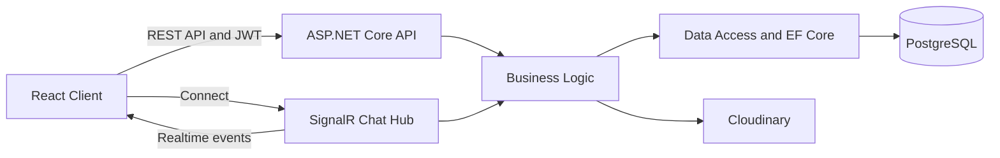

# CirMin Chat

A full-stack real-time messaging application built with React, TypeScript, ASP.NET Core, SignalR, PostgreSQL, and Entity Framework Core.

> Live demo: Coming soon

## Features

- Real-time direct and group messaging with SignalR
- JWT authentication with refresh-token support
- Online presence and user status updates
- Friend requests and friend management
- Conversation and message pagination
- User profile and avatar management
- Cloudinary image storage
- Vietnamese and English localization
- Responsive light and dark user interface

## Tech Stack

### Frontend

- React 19
- TypeScript
- Vite
- Tailwind CSS
- shadcn/ui and Radix UI
- Zustand
- Axios
- React Hook Form and Zod
- SignalR Client
- i18next

### Backend

- ASP.NET Core Web API
- SignalR
- Entity Framework Core
- PostgreSQL
- JWT authentication
- FluentValidation
- Cloudinary
- xUnit
- Testcontainers

## Architecture



The backend follows a layered architecture that separates API, business logic, data access, and shared contracts.

## Project Structure

```text
cirmin-chat/
├── backend/
│   ├── src/
│   │   ├── CirMin.API/
│   │   ├── CirMin.BusinessLogic/
│   │   ├── CirMin.Contracts/
│   │   └── CirMin.DataAccess/
│   └── tests/
│       ├── CirMin.Contracts.Tests/
│       └── CirMin.API.IntegrationTests/
└── frontend/
    └── src/
        ├── components/
        ├── hooks/
        ├── pages/
        ├── services/
        ├── stores/
        └── types/
```

## Getting Started

### Prerequisites

- .NET SDK 9
- Node.js
- PostgreSQL
- Docker, required for integration tests
- A Cloudinary account for avatar uploads

### Backend Setup

```powershell
cd backend

dotnet user-secrets set `
  --project src/CirMin.API `
  "ConnectionStrings:DefaultConnection" `
  "Host=localhost;Port=5432;Database=cirmin;Username=postgres;Password=postgres"

dotnet user-secrets set `
  --project src/CirMin.API `
  "Jwt:SecretKey" `
  "replace-with-a-long-random-secret"

dotnet user-secrets set `
  --project src/CirMin.API `
  "Cloudinary:CloudName" `
  "your-cloud-name"

dotnet user-secrets set `
  --project src/CirMin.API `
  "Cloudinary:ApiKey" `
  "your-api-key"

dotnet user-secrets set `
  --project src/CirMin.API `
  "Cloudinary:ApiSecret" `
  "your-api-secret"

dotnet ef database update `
  --project src/CirMin.DataAccess `
  --startup-project src/CirMin.API

dotnet run --project src/CirMin.API
```

Swagger UI is available in the development environment at the backend Swagger URL shown in the terminal.

### Frontend Setup

```powershell
cd frontend
Copy-Item .env.example .env.local
npm ci
npm run dev
```

Update `.env.local` with the URL of the running backend.

## Quality Checks

### Frontend

```powershell
cd frontend
npm run lint
npm run build
```

### Backend

```powershell
cd backend
dotnet build CirMin.sln --configuration Release
dotnet test CirMin.sln --configuration Release
```

Integration tests use Testcontainers and require Docker to be running.

## Security

Secrets and production credentials are not committed to the repository. Local configuration should use .NET User Secrets or ignored environment files.

## Roadmap

- Automated CI pipeline
- Frontend unit and component tests
- End-to-end tests with Playwright
- Docker Compose development environment
- Improved health checks and observability
- Frontend bundle optimization